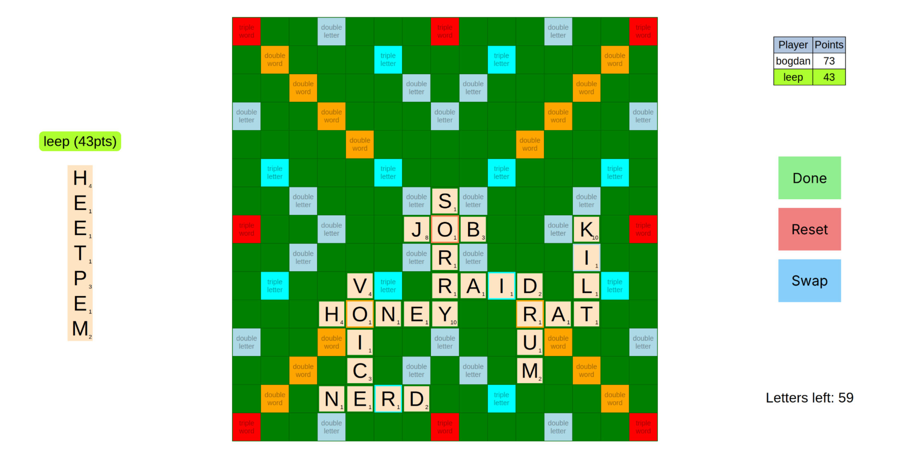

# sCRBle

Front-end code for the sCRBle game (it's just scrabble).

## Why ?

I wanted to play this with some people over the internet but I didn't find any great websites to play it

## How to set up ?

1. Clone and start the [sCRBle server](https://github.com/CRBl69/scrble-server).
1. Run `npm run build`.
1. Run `npm run start`.

Optionally, set `BACKEND_DOMAIN` and `BACKEND_PORT` if the server is not running on localhost with default settings.
